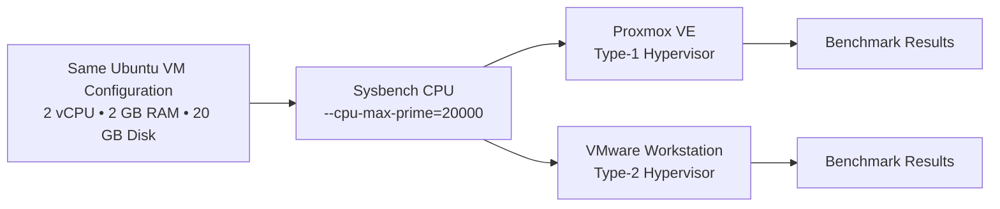
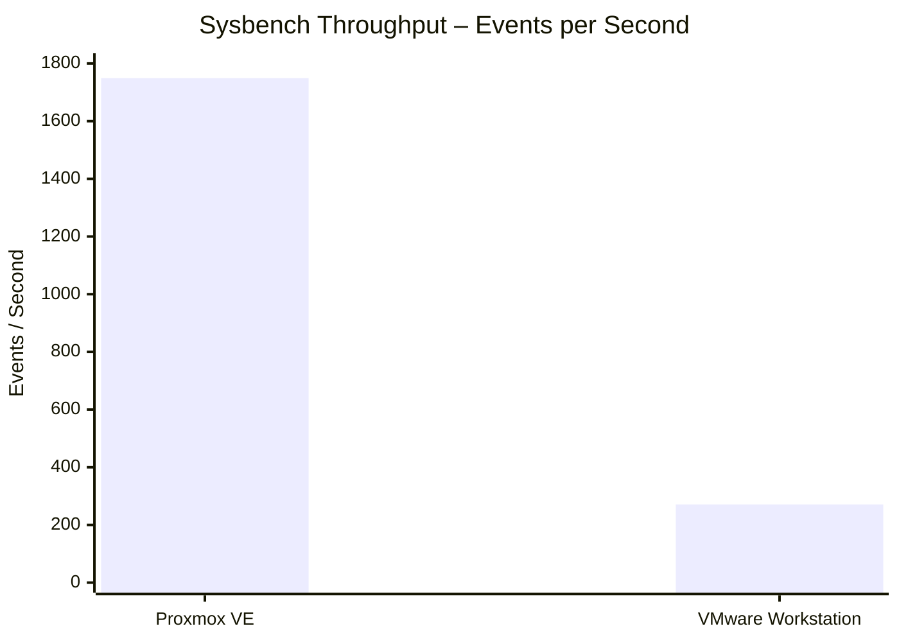
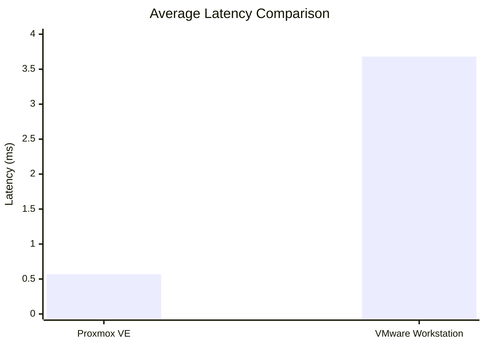
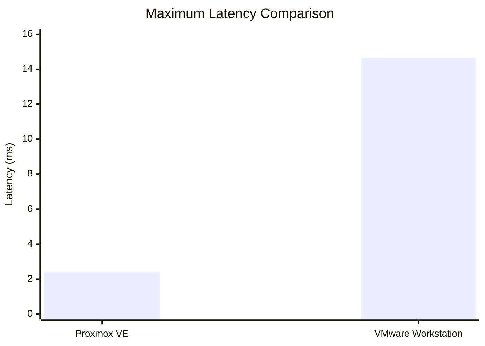
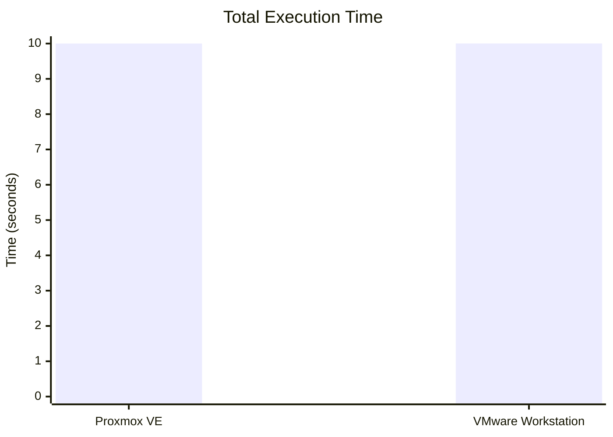
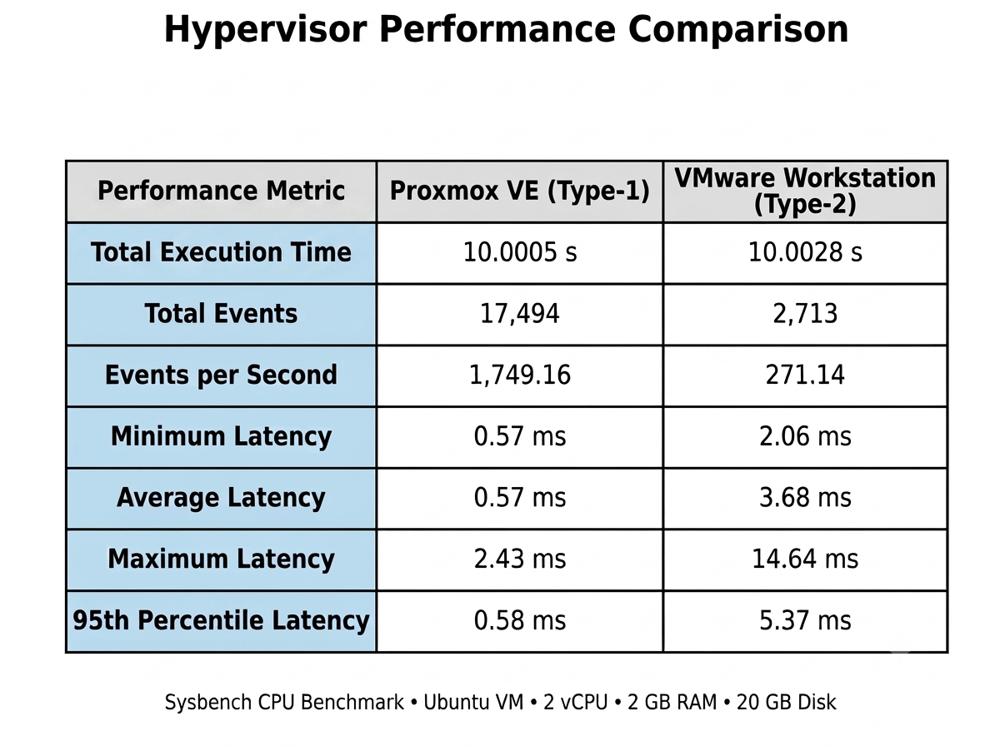

# CC Experiment 01 – Hypervisor Performance Analysis

<p align="center">
  <b>Type-1 vs Type-2 Hypervisor Performance using Sysbench</b><br>
  <sub>Cloud Computing • Ubuntu VM • CPU Benchmarking</sub>
</p>

<p align="center">
  
  
  
  
</p>

---

## About the Experiment

This Cloud Computing experiment compares the CPU performance of virtual machines running on two different hypervisor architectures:

| Hypervisor | Architecture |
|---|---|
| **Proxmox VE** | Type-1 Hypervisor |
| **VMware Workstation** | Type-2 Hypervisor |

The same CPU benchmark was executed inside Ubuntu virtual machines configured with the same basic resources. The recorded metrics include execution time, total events, event throughput, and latency.

---

## Objective

The objectives of this experiment are to:

1. Create an Ubuntu virtual machine using a **Type-1 hypervisor**.
2. Create an Ubuntu virtual machine using a **Type-2 hypervisor**.
3. Keep the virtual-machine resources consistent.
4. Run the same **Sysbench CPU benchmark** on both systems.
5. Record execution time, total events, throughput, and latency.
6. Compare the observed benchmark results.

---

## Tools & Technologies

| Component | Configuration |
|---|---|
| **Type-1 Hypervisor** | Proxmox VE |
| **Type-2 Hypervisor** | VMware Workstation |
| **Guest OS** | Ubuntu 24.04 |
| **CPU Allocation** | 2 vCPU |
| **Memory** | 2 GB |
| **Virtual Disk** | 20 GB |
| **Benchmark Tool** | Sysbench 1.0.20 |
| **CPU Benchmark** | `sysbench cpu --cpu-max-prime=20000 run` |

---

## Experimental Setup

Both virtual machines were configured with the same basic guest resources:

```text
┌──────────────────────────────────────────────┐
│              Ubuntu Virtual Machine          │
├──────────────────────────────────────────────┤
│  CPU       → 2 vCPU                          │
│  RAM       → 2048 MB                         │
│  Disk      → 20 GB                           │
│  Workload  → Sysbench CPU                    │
│  Prime     → 20000                           │
└──────────────────────────────────────────────┘
```

### Hypervisor environments



---

## Benchmark Procedure

### 1. Install Sysbench

```bash
sudo apt update
sudo apt install sysbench -y
```

### 2. Verify Sysbench

```bash
sysbench --version
```

### 3. Run the CPU benchmark

```bash
sysbench cpu --cpu-max-prime=20000 run
```

### 4. Record the following metrics

- Total execution time
- Total number of events
- Events per second
- Minimum latency
- Average latency
- Maximum latency
- 95th percentile latency

---

# Type-1 Hypervisor – Proxmox VE

The Proxmox virtual machine was configured with the required CPU, memory, disk, and network resources. Ubuntu was installed and the system configuration was verified before running the benchmark.

### Recorded Sysbench Result

| Metric | Result |
|---|---:|
| Total execution time | **10.0005 s** |
| Total events | **17,494** |
| Events per second | **1,749.16** |
| Minimum latency | **0.57 ms** |
| Average latency | **0.57 ms** |
| Maximum latency | **2.43 ms** |
| 95th percentile latency | **0.58 ms** |

### Evidence

Proxmox screenshots are available in:

```text
screenshots/type1-proxmox/
```

---

# Type-2 Hypervisor – VMware Workstation

The VMware virtual machine was configured with the same basic guest resources and Ubuntu was installed. The same system verification steps and Sysbench workload were used.

### Recorded Sysbench Result

| Metric | Result |
|---|---:|
| Total execution time | **10.0028 s** |
| Total events | **2,713** |
| Events per second | **271.14** |
| Minimum latency | **2.06 ms** |
| Average latency | **3.68 ms** |
| Maximum latency | **14.64 ms** |
| 95th percentile latency | **5.37 ms** |

### 📸 Evidence

VMware screenshots are available in:

```text
screenshots/type2-vmware/
```

---

# Performance Comparison

## Complete Benchmark Table

| Metric | Proxmox VE<br>Type-1 | VMware Workstation<br>Type-2 |
|---|---:|---:|
| **Total Execution Time** | 10.0005 s | 10.0028 s |
| **Total Events** | 17,494 | 2,713 |
| **Events per Second** | 1,749.16 | 271.14 |
| **Minimum Latency** | 0.57 ms | 2.06 ms |
| **Average Latency** | 0.57 ms | 3.68 ms |
| **Maximum Latency** | 2.43 ms | 14.64 ms |
| **95th Percentile Latency** | 0.58 ms | 5.37 ms |

---

## Graph 1 – Events per Second



The recorded throughput was **1,749.16 events/sec** for Proxmox VE and **271.14 events/sec** for VMware Workstation.

---

## Graph 2 – Average Latency



The recorded average latency was **0.57 ms** for Proxmox VE and **3.68 ms** for VMware Workstation.

---

## Graph 3 – Maximum Latency



The recorded maximum latency was **2.43 ms** for Proxmox VE and **14.64 ms** for VMware Workstation.

---

## Graph 4 – Total Execution Time



The total execution times were very close: **10.0005 s** and **10.0028 s**, respectively.

---

# Observed Difference

For the recorded benchmark runs:

| Observation | Difference |
|---|---:|
| Total events | **14,781 more events** on Proxmox |
| Events/sec | **1,478.02 more events/sec** on Proxmox |
| Average latency | **3.11 ms lower** on Proxmox |
| Maximum latency | **12.21 ms lower** on Proxmox |

### Throughput ratio

```text
1749.16 / 271.14 ≈ 6.45
```

The recorded Proxmox throughput was approximately **6.45×** the VMware throughput in this benchmark run.

### Average latency ratio

```text
3.68 / 0.57 ≈ 6.46
```

The recorded VMware average latency was approximately **6.46×** the Proxmox average latency.

> **Note:** These ratios describe the specific experimental runs documented in this repository. They should not be interpreted as universal performance ratios for every hardware, hypervisor, VM configuration, or workload.

---

# Key Observation

One interesting point is that the **total execution times are almost identical**, while the event counts and latency measurements differ considerably.

| Metric | Proxmox VE | VMware Workstation |
|---|---:|---:|
| Execution time | 10.0005 s | 10.0028 s |
| Total events | 17,494 | 2,713 |
| Events/sec | 1,749.16 | 271.14 |

This shows why a benchmark should not be interpreted using execution time alone. Throughput and latency provide additional information about the recorded behavior of the two VM environments.

---

# Experimental Evidence

## Proxmox VE – Type-1

The Proxmox screenshots document:

- Proxmox dashboard
- VM configuration
- VM running state
- Ubuntu console
- CPU and memory configuration
- Sysbench output
- Resource monitoring

Location:

```text
screenshots/type1-proxmox/
```

## VMware Workstation – Type-2

The VMware screenshots document:

- VM configuration
- VM running state
- CPU and memory configuration
- Sysbench output

Location:

```text
screenshots/type2-vmware/
```

## Final Comparison

The final comparison screenshot is stored in:

```text
screenshots/comparison/01-hypervisor-performance-comparison.png
```

### Benchmark Comparison



---

# 📁 Repository Structure

```text
CC-Experiment-01-Hypervisor-Analysis/
│
├── 📂 screenshots/
│   │
│   ├── 📂 type1-proxmox/
│   │   ├── 01-proxmox-dashboard.png
│   │   ├── 02-proxmox-vm-configuration.png
│   │   ├── 03-proxmox-vm-running.png
│   │   ├── 04-proxmox-ubuntu-console.png
│   │   ├── 05-proxmox-system-configuration.png
│   │   ├── 06-proxmox-sysbench-result.png
│   │   └── 07-proxmox-resource-monitoring.png
│   │
│   ├── 📂 type2-vmware/
│   │   ├── 01-vmware-vm-configuration.png
│   │   ├── 02-vmware-vm-running.png
│   │   ├── 03-vmware-system-configuration.png
│   │   └── 04-vmware-sysbench-result.png
│   │
│   └── 📂 comparison/
│       └── 01-hypervisor-performance-comparison.png
│
├── 📂 results/
│   └── performance-analysis.md
│
└── 📄 README.md
```

---

# How to Reproduce

### Step 1
Create an Ubuntu VM on **Proxmox VE**.

### Step 2
Create an Ubuntu VM on **VMware Workstation**.

### Step 3
Use the same basic VM configuration:

```text
CPU    → 2 vCPU
RAM    → 2 GB
Disk   → 20 GB
OS     → Ubuntu
```

### Step 4
Install Sysbench:

```bash
sudo apt update
sudo apt install sysbench -y
```

### Step 5
Run:

```bash
sysbench cpu --cpu-max-prime=20000 run
```

### Step 6
Record the benchmark output.

### Step 7
Compare:

```text
Execution Time
Total Events
Events / Second
Minimum Latency
Average Latency
Maximum Latency
95th Percentile Latency
```

---

# Results File

The detailed benchmark analysis is available here:

**[`results/performance-analysis.md`](results/performance-analysis.md)**

It contains the detailed calculations, benchmark interpretation, graphs, and experimental observations.

---

# Conclusion

This experiment documents the CPU benchmark behavior of Ubuntu virtual machines running on **Proxmox VE (Type-1)** and **VMware Workstation (Type-2)** using the same basic VM resources and Sysbench workload.

For the recorded runs:

- Proxmox reported **1,749.16 events/sec**.
- VMware Workstation reported **271.14 events/sec**.
- Proxmox recorded **0.57 ms average latency**.
- VMware Workstation recorded **3.68 ms average latency**.
- Total execution time was approximately **10 seconds** for both runs.

The results demonstrate measurable differences in the recorded throughput and latency metrics under the specific experimental conditions documented in this repository.

> **Scope:** The observations are specific to these benchmark runs and configurations. They should not be generalized to all systems or workloads.

---

