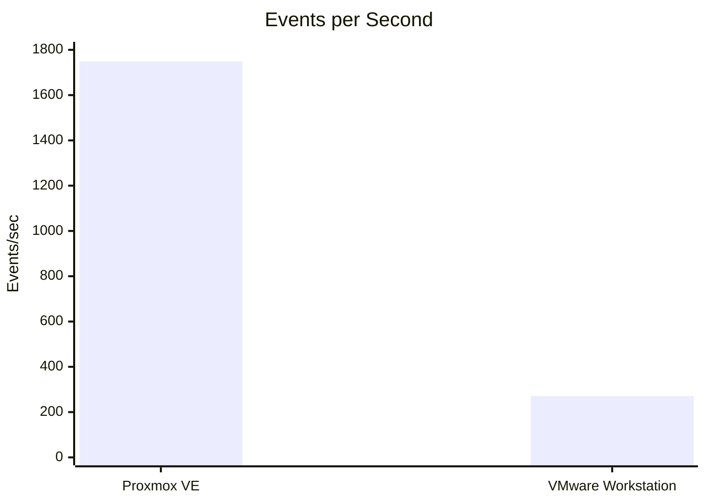
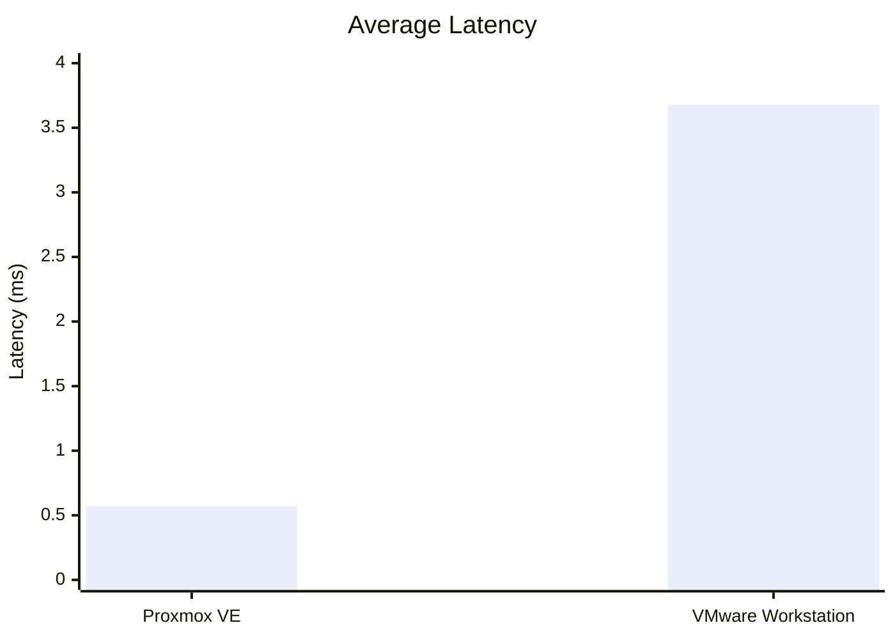
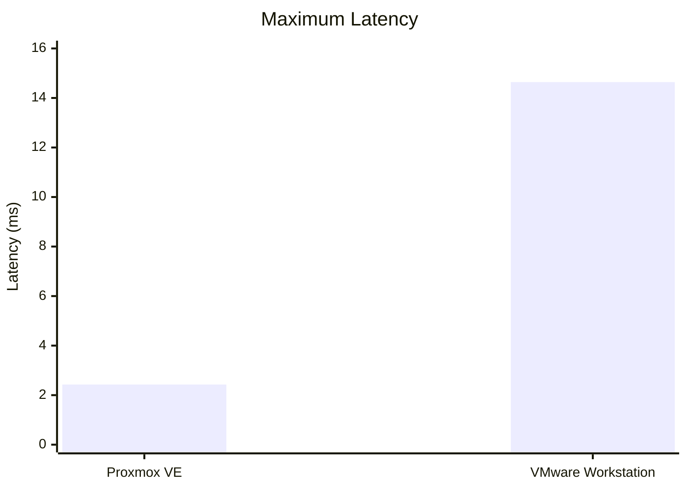
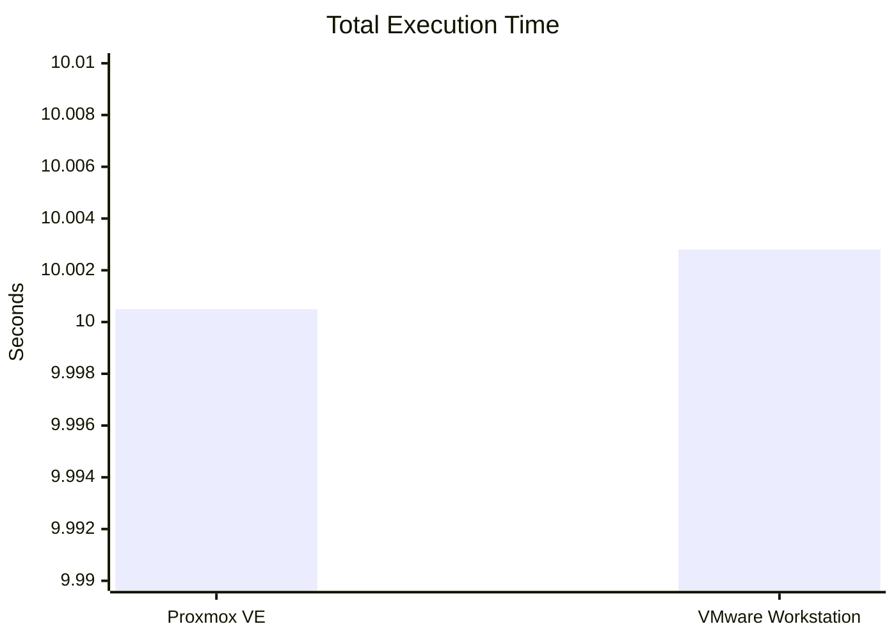
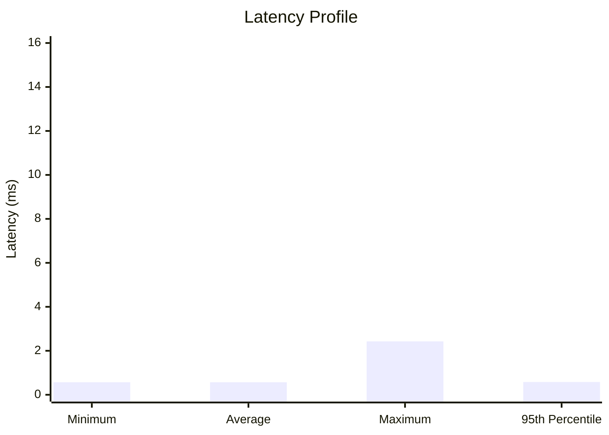
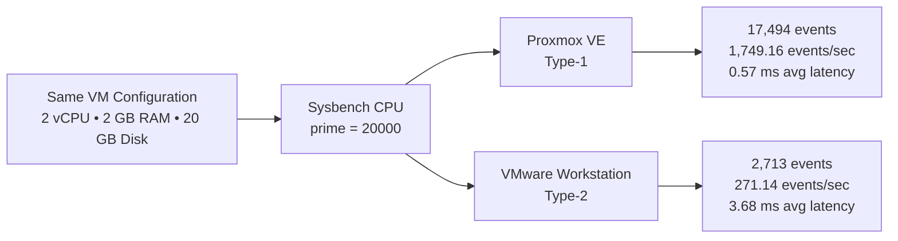

# Hypervisor Performance Analysis

> **Experiment:** Type-1 vs Type-2 Hypervisor Performance Analysis  
> **Benchmark:** Sysbench CPU  
> **Guest OS:** Ubuntu  
> **VM configuration:** 2 vCPU • 2 GB RAM • 20 GB Disk  
> **Comparison:** Proxmox VE (Type-1) vs VMware Workstation (Type-2)

---

## 1. Experiment Objective

The objective of this experiment is to compare the CPU performance characteristics of a **Type-1 hypervisor (Proxmox VE)** and a **Type-2 hypervisor (VMware Workstation)** using the same virtual-machine resource configuration and the same Sysbench CPU benchmark.

The laboratory manual specifies identical VM resources for both environments so that the benchmark results can be compared under the same guest configuration. fileciteturn0file0L35-L46

### Benchmark command

```bash
sysbench cpu --cpu-max-prime=20000 run
```

---

## 2. Test Configuration

| Parameter | Configuration |
|---|---|
| Type-1 Hypervisor | Proxmox VE |
| Type-2 Hypervisor | VMware Workstation |
| Guest OS | Ubuntu |
| vCPU | 2 |
| RAM | 2 GB |
| Disk | 20 GB |
| Benchmark | Sysbench CPU |
| CPU workload | `--cpu-max-prime=20000` |

The manual also requires benchmark output containing total execution time, total events, events per second and latency measurements. fileciteturn0file0L93-L102

---

## 3. Benchmark Results

### Raw measurements

| Performance Metric | Proxmox VE (Type-1) | VMware Workstation (Type-2) |
|---|---:|---:|
| **Total Execution Time** | 10.0005 s | 10.0028 s |
| **Total Events** | 17,494 | 2,713 |
| **Events per Second** | 1,749.16 | 271.14 |
| **Minimum Latency** | 0.57 ms | 2.06 ms |
| **Average Latency** | 0.57 ms | 3.68 ms |
| **Maximum Latency** | 2.43 ms | 14.64 ms |
| **95th Percentile Latency** | 0.58 ms | 5.37 ms |

---

## 4. Visual Comparison

### Events per Second



**Observation:** The measured event throughput is substantially higher for Proxmox VE in this benchmark run.

### Average Latency



**Observation:** The reported average latency is lower for the Proxmox VE VM.

### Maximum Latency



**Observation:** The maximum observed latency is considerably higher in the VMware Workstation run.

---

## 5. Relative Difference

The following values are calculated directly from the measured results above.

| Metric | Relative difference |
|---|---:|
| Events per second | Proxmox ≈ **6.45×** VMware |
| Minimum latency | VMware ≈ **3.61×** Proxmox |
| Average latency | VMware ≈ **6.46×** Proxmox |
| Maximum latency | VMware ≈ **6.02×** Proxmox |
| 95th percentile latency | VMware ≈ **9.26×** Proxmox |

### Throughput ratio

\[
\text{Throughput Ratio}
=
\frac{1749.16}{271.14}
\approx 6.45
\]

Therefore, in this particular benchmark run, the measured **events-per-second value for Proxmox VE was approximately 6.45 times the VMware Workstation value**.

### Average latency ratio

\[
\text{Latency Ratio}
=
\frac{3.68}{0.57}
\approx 6.46
\]

The measured average latency for VMware Workstation was therefore approximately **6.46 times** the Proxmox VE value.

> **Important:** These ratios describe this experiment's measured run. They should not be interpreted as universal performance ratios for every workload, host machine, or hypervisor configuration.

---

## 6. Interesting Result: Execution Time vs Throughput

One of the most noticeable aspects of the result is that the **total execution times are almost identical**:

- Proxmox VE: **10.0005 s**
- VMware Workstation: **10.0028 s**
- Difference: **0.0023 s**

At the same time, the recorded total event counts differ substantially:

- Proxmox VE: **17,494 events**
- VMware Workstation: **2,713 events**

This means that looking only at total execution time would hide an important difference visible in the Sysbench event and latency measurements.



---

## 7. Latency Profile

The latency measurements show a consistent difference across minimum, average, maximum and 95th-percentile values.



### Latency values

| Latency measure | Proxmox VE | VMware Workstation |
|---|---:|---:|
| Minimum | 0.57 ms | 2.06 ms |
| Average | 0.57 ms | 3.68 ms |
| Maximum | 2.43 ms | 14.64 ms |
| 95th percentile | 0.58 ms | 5.37 ms |

The 95th-percentile value is useful because it shows the latency experienced by the slower portion of benchmark operations without relying only on the single maximum value.

---

## 8. Result Interpretation

### Proxmox VE

The recorded Proxmox VE run shows:

- Higher reported events per second.
- Lower minimum latency.
- Lower average latency.
- Lower maximum latency.
- Lower 95th-percentile latency.
- Nearly the same total execution time as the VMware run.

### VMware Workstation

The recorded VMware Workstation run shows:

- Lower reported events per second.
- Higher minimum latency.
- Higher average latency.
- Higher maximum latency.
- Higher 95th-percentile latency.
- Nearly the same total execution time as the Proxmox run.

These observations are based only on the benchmark values recorded for this experiment.

---

## 9. Performance Summary



---

## 10. Experimental Evidence

The laboratory manual requires screenshots for the individual hypervisor configurations, system configuration, Sysbench results, resource monitoring and the final comparison. The expected repository structure places this analysis file inside the `results/` directory. 

### Comparison screenshot


> If your GitHub folder names differ, update the relative image path above to match your repository structure.

---

## 11. Conclusion

For this specific Sysbench CPU experiment, the recorded measurements show a clear difference in **reported event throughput and latency** between the two virtualized environments.

The Proxmox VE run recorded **1,749.16 events/sec** compared with **271.14 events/sec** for VMware Workstation. The reported average latency was **0.57 ms** for Proxmox VE and **3.68 ms** for VMware Workstation.

However, the total execution times were almost identical at approximately **10 seconds** for both runs. Therefore, the benchmark should be evaluated using the complete set of measurements rather than total execution time alone.

> **Scope note:** These results represent the configuration and benchmark run documented in this experiment. Hypervisor performance can vary with host hardware, VM configuration, workload, CPU scheduling, virtualization settings and other system conditions.

---


